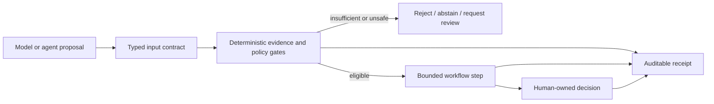

# Evidence-Driven Agent & Scientific ML Portfolio

Public, runnable engineering artifacts from four current project lines:
EvidenceOps, CarePlan, Dynamics Atlas, and HSP90/LiGaMD. The common theme is
not autonomous model behavior. It is the control layer around a model:
evidence contracts, deterministic validation, durable state, human authority,
failure recovery, and explicit limits on what a result may claim.

[中文导航](README.zh-CN.md)

## Featured projects

| Project | Public surface | What is implemented | Evidence boundary |
| --- | --- | --- | --- |
| **EvidenceOps / EvidenceUp** | [Public MVP repository](https://github.com/alex051107/evidenceops-public-mvp) | Public-source registry, parsing and chunking, citation-aware retrieval, structured extraction, risk checks, a small evaluation set, failure analysis, and a static evidence console. | Public and synthetic inputs only. The static site is not evidence of a production backend, customer use, or deployment scale. |
| **CarePlan** | [`careplan_workflow_harness/`](careplan_workflow_harness/) | Synthetic-only intake, deterministic hard stops, SQLite-backed idempotency, a typed draft boundary, fail-closed schema validation, optimistic review state, and a pharmacist-only approval gate. | A portfolio workflow, not clinical software. It accepts no real patient data, gives no medical advice, and grants no approval authority to a model. |
| **Dynamics Atlas** | [`scientific_evidence_harness/`](scientific_evidence_harness/) | Source identity, mapping coverage, measurement semantics, maturity state, and claim-ceiling checks for scientific evidence cards. | Synthetic fixtures demonstrate governance behavior. They do not establish biological findings, cross-system generalization, or Agent effectiveness. |
| **HSP90 / LiGaMD experimental-pKoff** | [`trajectory_event_harness/`](trajectory_event_harness/) · [LiGaMD pKoff Toolkit](https://github.com/alex051107/ligamd-pkoff-toolkit) | Replica-aware sustained-event extraction with recapture and censoring, plus a public trajectory-featurization and experimental-pKoff toolkit. | Experimental `pKoff` is an assay-derived supervised-learning label. Neither harness claims a physical dissociation rate from simulation time or a selected final scientific model. |

## Supporting control-plane project

[`career_agent_harness/`](career_agent_harness/) applies the same design to a
human-controlled job-search workflow: source freshness, evidence-backed
readiness, bounded scheduling, confirmation before external action, and an
allowlisted public snapshot. It never applies, sends, schedules, or records an
outcome by itself.

## Why these projects belong together



Across domains, an agent may propose work. It does not silently promote a
claim, mutate an external system, or take ownership of a human decision.

## Run the focused checks

All four public harnesses use Python's standard library at runtime.

```bash
python career_agent_harness/scripts/test_harness.py
python -m unittest discover -s careplan_workflow_harness/tests -v
python -m unittest discover -s scientific_evidence_harness/tests -v
python -m unittest discover -s trajectory_event_harness/tests -v
```

Each project README includes a small reproducible example and its own claim
boundary. The repository-level GitHub Actions workflow runs the same four test
suites when a harness changes.

## Public-release boundary

This repository intentionally excludes:

- resumes, portraits, personal contact records, application records, and raw
  interview or meeting transcripts;
- API keys, tokens, cookies, credentials, private environment files, and local
  absolute paths;
- real patient or customer data;
- unpublished assay tables, raw molecular-dynamics trajectories, topology
  files, collaborator records, and campaign-specific identity reconciliation;
- claims of production deployment, clinical effectiveness, autonomous external
  action, held-out Agent value, or physical `koff` estimation unless a separate
  public receipt supports them.

Examples are synthetic or use explicitly public sources. A passing test proves
the scoped software contract exercised by that test; it is not a deployment,
scientific-validation, or user-impact claim.

## Earlier prototypes

The repository also retains three earlier analytics prototypes:
[`bee_forecasting/`](bee_forecasting/),
[`water_level_forecasting/`](water_level_forecasting/), and
[`virtual_screening/`](virtual_screening/). They are preserved for code-reading
context and are not part of the current four-project evidence package. Their
roadmap language should not be interpreted as proof that every planned model,
data source, dashboard, or end-to-end run has been completed.
