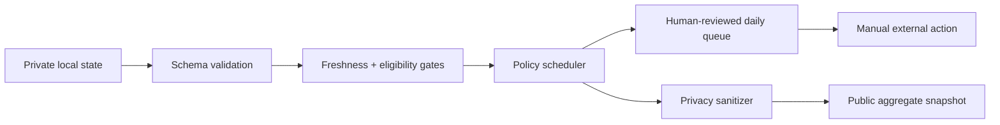

# Career Agent Harness

A model-agnostic control plane for running a high-stakes job search without
letting an agent silently mutate external systems.

This project packages a real internship-search workflow as an **agent
harness**: structured private state enters a deterministic policy engine,
freshness and evidence gates decide which actions are eligible, and the
operator receives a bounded daily queue. Applications, messages, scheduling,
and outcome updates always remain human-confirmed.

## Why this is a harness, not a chatbot

The useful engineering is around the model:

- **State contract** — jobs, contacts, deadlines, activity, and readiness
  evidence have explicit schemas.
- **Evidence gates** — readiness cannot advance from a date or a plan target;
  every level requires contiguous reviewed evidence.
- **Temporal grounding** — stale job records and expired deadlines are removed
  from the executable queue until a primary source is reverified.
- **Policy scheduler** — urgent OA/interview work preempts project features;
  capacity is a ceiling, not a quota.
- **Human approval boundary** — every proposed external action carries
  `requiresConfirmation: true`; the harness never submits or sends.
- **Privacy firewall** — the daily queue may contain private detail, while the
  exported snapshot contains only aggregate, explicitly sanitized fields.
- **Regression harness** — tests cover non-destructive initialization,
  priority order, stale evidence, readiness gaps, privacy, and source-state
  immutability.



## Quick start

Requires Python 3.9+ and no third-party runtime dependencies.

```bash
python3 scripts/harness.py --root ./private-state --init --date 2026-07-23
python3 scripts/harness.py --root ./private-state --date 2026-07-23
```

Then inspect:

- `private-state/daily/2026-07-23.md` — private, human-reviewed action queue.
- `private-state/exports/site-snapshot.json` — sanitized aggregate output.

The generated `private-state/` directory is ignored by Git. Edit its JSON files
with verified facts, rerun the harness, and record outcomes only after they
actually happen.

## Example state

`assets/state-template/` is intentionally empty and safe to publish. The
bundled plan is synthetic and exists only to make the demo reproducible. It
contains no real companies, contacts, applications, resumes, or URLs.

## Validation

```bash
python3 scripts/test_harness.py
python3 scripts/harness.py --root /tmp/career-agent-demo --init --date 2026-07-23
```

The tests assert that:

1. initialization never overwrites user state;
2. source records are not mutated during planning;
3. dates and plan milestones cannot promote readiness;
4. stale records cannot become application actions;
5. urgent live processes preempt lower-value feature work;
6. the public snapshot excludes private identities, record IDs, and URLs.

## Honest scope

This repository is the deterministic operating layer, not an autonomous
application bot and not a claim of hiring success. An LLM or other planner can
propose updates upstream, but this harness is designed to validate, constrain,
prioritize, and sanitize those proposals before a person acts.

See [architecture](docs/architecture.md) and
[safety contract](docs/safety-contract.md) for the design rationale.

