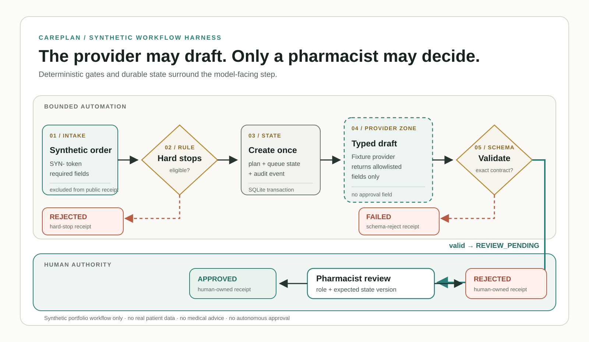
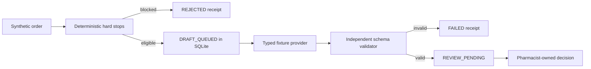

# CarePlan Workflow Harness

A small, deterministic control plane for a synthetic reviewer workflow. It
distills the public engineering contracts from a larger CarePlan portfolio
project without publishing its private repository history, cloud handoff, or
candidate-specific material.

The harness is intentionally not a medical model. It demonstrates how a draft
provider can be placed behind rules, a strict schema, durable idempotency, an
optimistic state version, and a reviewer-only final decision.


*Illustrated reading: deterministic eligibility comes first; the provider can
create a structured draft inside its boundary; schema validation produces a
pending review; only the human reviewer can make the final decision.*

## Technical workflow



The dashed provider box is the full authority boundary of the model-facing
step: it may return typed draft fields, but it cannot write an approval field
or move the plan beyond `REVIEW_PENDING`. Red branches are explicit stopped
states; the lower lane belongs to an authenticated pharmacist role.

## Control flow



## What it enforces

- only records explicitly marked `synthetic` with a `SYN-` token are accepted;
- a repeated idempotency key returns the original plan, while changed reuse is
  rejected;
- provider output has an exact allowlist and may not contain an approval field;
- a provider cannot transition a plan beyond `REVIEW_PENDING`;
- only a `pharmacist:*` reviewer may approve or reject;
- the expected state version prevents a stale second review;
- the public receipt contains hashes and audit events, not the raw synthetic
  order or token.

## Run the demo

Requires Python 3.11+ and no third-party dependencies.

```bash
python careplan_harness.py \
  --input examples/synthetic_order.json \
  --database /tmp/careplan-harness.sqlite3 \
  --output /tmp/careplan-receipt.json
```

That command stops at `REVIEW_PENDING`. A human-invoked demo review can be
added explicitly:

```bash
python careplan_harness.py \
  --input examples/synthetic_order.json \
  --database /tmp/careplan-harness-reviewed.sqlite3 \
  --output /tmp/careplan-reviewed-receipt.json \
  --reviewer pharmacist:demo \
  --decision APPROVE
```

Run the regression suite:

```bash
python -m unittest discover -s tests -v
```

## Honest scope

This is a synthetic portfolio harness, not clinical software, a clinical
decision-support system, or evidence of patient benefit. It contains no drug
recommendation logic, accepts no real patient data, contacts no model service,
and has no autonomous approval path. SQLite demonstrates a single-process
durability and idempotency contract; it is not a claim of distributed or
production deployment.
