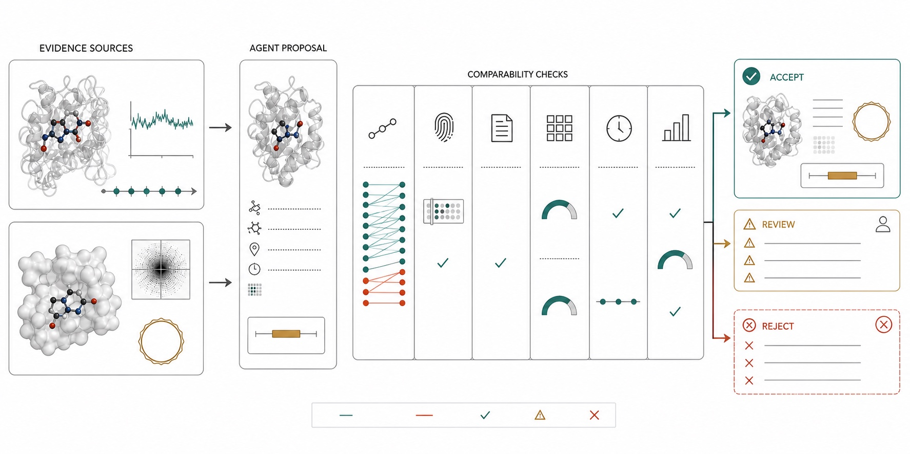
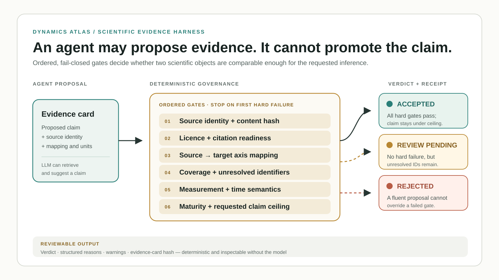

# Scientific Evidence Harness

A deterministic validation layer for scientific agents that compare molecular
dynamics, experimental ensembles, structural databases, and generated
structures.

The project is distilled from a dynamics-atlas research workflow. Its central
idea is that retrieval is not enough: before an agent can use a source in a
claim, it must prove source identity, residue-axis mapping, provenance,
measurement semantics, and the allowed inference level.



*Illustrated reading: an Agent assembles a candidate evidence card, but
deterministic comparability gates own the route. Compatible evidence becomes
an inspectable bundle; mismatched mapping or measurement semantics stops or
defers the claim.*

## Technical workflow



The model-facing side of the system may retrieve evidence and propose a claim.
The deterministic side owns comparability and claim scope. A reviewer can read
the verdict, reasons, warnings, and card hash without trusting or rerunning the
model.

## Harness contract

Each evidence card is evaluated through ordered, fail-closed gates:

1. source identity and content hash;
2. license and citation readiness;
3. explicit source-to-target axis mapping;
4. mapping coverage and unresolved-identifier budget;
5. measurement and time semantics;
6. maturity state;
7. claim ceiling.

The harness emits `accepted`, `review_pending`, or `rejected`, plus structured
reasons. A fluent answer cannot override a failed gate.

```bash
python3 evidence_harness.py \
  --input examples/evidence_cards.json \
  --output /tmp/evidence_report.json

python3 -m unittest discover -s tests -v
```

## Why this is agent infrastructure

- The LLM may retrieve and propose a claim.
- The harness decides whether the supporting source is comparable and mature
  enough for that claim.
- Unsupported mechanistic, thermodynamic, or kinetic language is blocked even
  when the source looks structurally similar.
- The report is deterministic, hash-addressed, and reviewable without the
  model.

All bundled cards are synthetic. No unpublished data or collaborator records
are included.
